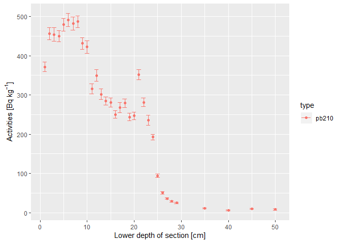
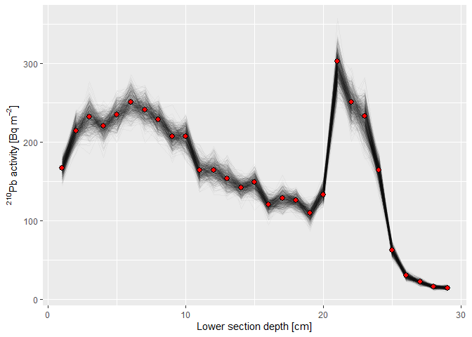
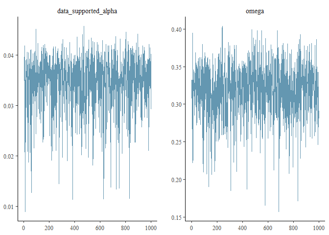
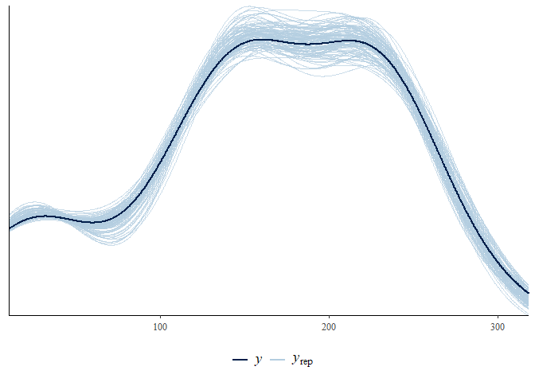

<!-- README.md is generated from README.Rmd. Please edit that file -->
plumstan
========

`plumstan` is an R package providing functions in order to compute age-depth models for sediment cores based on measured <sup>210</sup>Pb activities using a Bayesian statistical framework developed and implemented in the R package [`plum`](https://github.com/maquinolopez/Plum) by Aquino-López et al (2018). In contrast to `plum`, `plumstan` relies on the programming language [`Stan`](https://github.com/stan-dev/stan) (Carpenter et al. 2017). in order to perform the Bayesian calculations. This has the advantage that the Bayesian model can directly be integrated into more complex models and modified and resulting models can be handled using the functions of the [`rstan`](https://github.com/stan-dev/rstan) package (Stan Development Team 2019). Moreover, MCMC sampling is efficient via `Stan`'s Hamiltonian Monte Carlo algorithm.

### How to install

Install `plumstan` with R:

``` r
devtools::install_github("henningte/plumstan")
```

### How to use

Load `plumstan` in R:

``` r
library("plumstan")
```

Load the sample data (derived from the publication of Aquino-López et al (2018)) and inspect the first rows.

``` r
head(plumstan::plumstan_sample_data)
#>   data_type depth_lower depth_upper mass_density activity activity_sd
#> 1     pb210           1           0        0.045   371.73       11.90
#> 2     pb210           2           1        0.047   456.39       15.08
#> 3     pb210           3           2        0.051   454.24       17.11
#> 4     pb210           4           3        0.049   449.64       14.43
#> 5     pb210           5           4        0.049   479.04       16.44
#> 6     pb210           6           5        0.051   490.97       16.75
#>   cs137_age cs137_age_sd
#> 1        NA           NA
#> 2        NA           NA
#> 3        NA           NA
#> 4        NA           NA
#> 5        NA           NA
#> 6        NA           NA
```

For `plumstan` to use the data, it needs to be converted to an object of class `plumstan_data_input`.

``` r
d <- plumstan::plumstan_data_input(plumstan_sample_data)
```

Inspect the <sup>210</sup>Pb activity profile in order to identify layers that can be used in order to estimate the supported <sup>210</sup>Pb activity.

``` r
plumstan:::plot.plumstan_data_input(d)
```



For the last 4 sections, the background <sup>210</sup>Pb activity level seems to be reached (Aquino-López et al. 2018). Therefore, the <sup>210</sup>Pb activities of the last 4 sections can be used to estimate the supported <sup>210</sup>Pb activity. The data are split accordingly into the part of the depth profile for which to estimate the age-depth relation (see below). For this, an index is constructed indicating which samples ar in which split:

``` r
# index to split the data
index_supported <- plumstan::plumstan_select_pb210_supported(data_input = d, d = 30)
index_supported
#>  [1]  TRUE  TRUE  TRUE  TRUE FALSE FALSE FALSE FALSE FALSE FALSE FALSE
#> [12] FALSE FALSE FALSE FALSE FALSE FALSE FALSE FALSE FALSE FALSE FALSE
#> [23] FALSE FALSE FALSE FALSE FALSE FALSE FALSE FALSE FALSE FALSE FALSE
```

These data can be fed into the `plumstan_model` function. The function constructs the artificial sections with fixed thickness for the age-depth model and a `Stan` model. A `thickness` of the artificial sections of 1 cm is chosen.

``` r
d_model <- 
  plumstan::plumstan_get_model(data_input = d, 
                               index_supported_pb210 = index_supported,
                               thickness = 1)
```

`plumstan_model` constructs a `plumstan_model` object that contains the data and the compiled `Stan` model from which `rstan`'s MCMC algorithm can sample.

`plumstan_fit` passes the data to `rstan::stan` in order to fit the `Stan` model contained in `d_model`. Thus, all options available for `rstan::stan` are also available for `plumstan_fit`.

``` r
d_fit <- 
  plumstan::plumstan_fit_model(
    d_model, 
    chains = 1,
    iter = 1500,
    warmup = 500)
#> 
#> SAMPLING FOR MODEL 'plumstan_model' NOW (CHAIN 1).
#> Chain 1: 
#> Chain 1: Gradient evaluation took 0 seconds
#> Chain 1: 1000 transitions using 10 leapfrog steps per transition would take 0 seconds.
#> Chain 1: Adjust your expectations accordingly!
#> Chain 1: 
#> Chain 1: 
#> Chain 1: Iteration:    1 / 1500 [  0%]  (Warmup)
#> Chain 1: Iteration:  150 / 1500 [ 10%]  (Warmup)
#> Chain 1: Iteration:  300 / 1500 [ 20%]  (Warmup)
#> Chain 1: Iteration:  450 / 1500 [ 30%]  (Warmup)
#> Chain 1: Iteration:  501 / 1500 [ 33%]  (Sampling)
#> Chain 1: Iteration:  650 / 1500 [ 43%]  (Sampling)
#> Chain 1: Iteration:  800 / 1500 [ 53%]  (Sampling)
#> Chain 1: Iteration:  950 / 1500 [ 63%]  (Sampling)
#> Chain 1: Iteration: 1100 / 1500 [ 73%]  (Sampling)
#> Chain 1: Iteration: 1250 / 1500 [ 83%]  (Sampling)
#> Chain 1: Iteration: 1400 / 1500 [ 93%]  (Sampling)
#> Chain 1: Iteration: 1500 / 1500 [100%]  (Sampling)
#> Chain 1: 
#> Chain 1:  Elapsed Time: 1.242 seconds (Warm-up)
#> Chain 1:                1.04 seconds (Sampling)
#> Chain 1:                2.282 seconds (Total)
#> Chain 1:
#> Warning: There were 1 divergent transitions after warmup. Increasing adapt_delta above 0.8 may help. See
#> http://mc-stan.org/misc/warnings.html#divergent-transitions-after-warmup
#> Warning: Examine the pairs() plot to diagnose sampling problems
```

`d_fit` is an object of class `plumstan_fit` that is an object of class `stanfit`. Thus, all functions of the R packages `rstan` and `bayesplot` may be used in order to investigate and validate the fitted model.

The sediment age posterior predictive distributions (i.e. the MCMC samples after warmup) for each depth of the input sediment profile can be extracted as `data.frame` by passing `d_model` and `d_fit` to the function `plumstan::plumstan_extract`.

``` r
d_extracted_fit <- 
  plumstan::plumstan_extract_samples(
    x = d_fit, 
    plumstan_model = d_model)
```

`d_extracted_fit` is a `data.frame` with three columns: (1) The depth of `d_chronology` the row corresponds to (`depth_lower`), (2) the iter of the MCMC (`iter`), (3) the sampled sediment age (`age`), (4) the sampled nusupported <sup>210</sup>Pb activity (`p_unsupported`), (5) the sampled depth accumulation rate until this depth (`m`), (6) the sampled memory parameter ω (`omega`), (7) the sampled supported <sup>210</sup>Pb activity (`p_supported`).

``` r
head(d_extracted_fit)
#>   iter data_type depth_profile depth_lower depth_upper      age
#> 1    1     pb210      measured          29          28 274.9063
#> 2    2     pb210      measured          29          28 232.2377
#> 3    3     pb210      measured          29          28 235.5477
#> 4    4     pb210      measured          29          28 253.2020
#> 5    5     pb210      measured          29          28 186.5483
#> 6    6     pb210      measured          29          28 233.5481
#>   depth_accumulation_rate depth_accumulation_rate_alpha pb210_tot
#> 1                      NA                            NA  16.73121
#> 2                      NA                            NA  16.63702
#> 3                      NA                            NA  16.39858
#> 4                      NA                            NA  16.22535
#> 5                      NA                            NA  15.40508
#> 6                      NA                            NA  15.99709
#>   pb210_supported     omega
#> 1        4.637890 0.2740272
#> 2        4.342211 0.2926137
#> 3        4.306121 0.3258331
#> 4        4.490591 0.3139288
#> 5        4.002054 0.2674669
#> 6        4.301273 0.3231475
```

With `d_extracted_fit`, it is easy to plot the modeled age-depth profile, e.g. using functions of `ggplot2`: Here, I plotted the estimated sediment ages versus lower section depths according to the first 500 draws of the MCMC algorithm.

``` r
# load ggplot2
library(ggplot2)

# plot
ggplot(data = d_extracted_fit[d_extracted_fit$iter <= 500 & d_extracted_fit$depth_profile == "measured",],
       mapping = aes(x = depth_lower, 
                     y = age, 
                     group = iter)) +
  geom_path(alpha = 0.04) +
  labs(x = "Lower section depth [cm]",
       y = "Modeled sediment age [yr]")
```


Similarly, the fitted total <sup>210</sup>Pb activities can be visualised (red dots represent the measured <sup>210</sup>Pb activities):

``` r
# plot
ggplot() +
  geom_path(data = d_extracted_fit[d_extracted_fit$iter <= 500 & d_extracted_fit$depth_profile == "measured",],
       mapping = aes(x = depth_lower, 
                     y = pb210_tot, 
                     group = iter),
       alpha = 0.04) +
  geom_point(data = d[!index_supported,], 
             mapping = aes(x = depth_lower, 
                           y = activity * 10 * mass_density),
             shape = 21,
             fill = "red",
             size = 2.5) +
  labs(x = "Lower section depth [cm]",
       y = expression(""^{210}*Pb~activity~"["*Bq~m^{-2}*"]"))
```



Packages such as [`bayesplot`](https://github.com/stan-dev/bayesplot) can be used to validate the model since it is built using `rstan`. For example, one may plot the marginal posterior distributions of the supported <sup>210</sup>Pb activity and the memory parameter ;:

``` r
# load the bayesplot package
library("bayesplot")

# extract the parameters from the d_fit
d_parameters <- as.data.frame(rstan::extract(d_fit))

# plot of marginal posterior distribution
bayesplot::mcmc_areas(d_parameters,
                      pars = c("data_supported_alpha", "omega"),
                      prob = 0.99)
```


... or a trace plot of these parameters:

``` r
bayesplot::mcmc_trace(d_parameters,
                      pars = c("data_supported_alpha", "omega"))
```



... or make a posterior predictive check for the model:

``` r
# load package stringr (just to construct an index for the predicted values in d_parameters)
library(stringr)
#> Warning: package 'stringr' was built under R version 3.4.4

# define an index for predicted values in d_parameters
d_predicted_index <- stringr::str_detect(colnames(d_parameters), "^p_tot\\.")

# plot the posterior predictive check
bayesplot::ppc_dens_overlay(y = d_model$stan_data$data_chronology_y,
                 yrep = as.matrix(d_parameters[1:100, d_predicted_index])) +
  theme(legend.position = "bottom")
```



The manual and vignette contain more information on the functions and important things to consider during Bayesian analysis, such as the choice of prior parameters.

### How it works

`plumstan` estimates the age of sediment layers (age-depth model) based on measured depth profiles of <sup>210</sup>Pb activities, needing measured <sup>210</sup>Pb activities and the corresponding measurement errors as input and yielding a posterior probability distribution (PPD) of the age of each depth section.

`plumstan` uses for this the statistical framework developed by Aquino-López et al (2018) that is inspired by the statistical framework of the popular software package for <sup>14</sup>C dating, [`Bacon`](https://github.com/cran/rbacon) (Blaauw and Christen 2011).

The age-depth profile is modeled conditional on (1) the decay of <sup>210</sup>Pb in the sediment leading to the measured <sup>210</sup>Pb activity profile and (2) a sediment accumulation model.

The sediment accumulation model models the sediment accumulation \[yr cm<sup>-1</sup>\] for artificially constructed sections with a fixed thickness. Sections are constructed from the surface (depth = 0 cm) until the deepest depth of the measured profile (Aquino-López et al. 2018).

The thickness can be specified manually. Increasing the thickness results in fewer sections and thus a less smooth representation of the age depth profile.

Key features of the sediment accumulation model are that (1) sediment accumulation rate is ≥ 0 and (2) the sediment accumulation rate of a constructed section depends on the sediment accumulation of the next deeper section. The strength of this dependency is estimated by the model, ranging from 0 (the sediment accumulation rates of subsequent sections are independent) to 1 (the sediment accumulation rates of subsequent sections are identical). These features lead to realistic constraints for estimated sediment accumulation rates (Aquino-López et al. 2018, Blaauw and Christen (2011)).

### How to cite

Please cite this software package as:

> Authors, (2019). *Compendium of R code and data for 'Title of paper'*. Accessed 07 Okt 2019. Online at <https://doi.org/xxx/xxx>

### Licenses

**Text and figures :** [CC-BY-4.0](http://creativecommons.org/licenses/by/4.0/)

**Code :** See the [DESCRIPTION](DESCRIPTION) file

**Data :** [CC-0](http://creativecommons.org/publicdomain/zero/1.0/) attribution requested in reuse

### Contributions

We welcome contributions from everyone. Before you get started, please see our [contributor guidelines](CONTRIBUTING.md). Please note that this project is released with a [Contributor Code of Conduct](CONDUCT.md). By participating in this project you agree to abide by its terms.

### Sources

The complete data is derived from Aquino-López et al (2018) and was restructured to match the requirements of `plumstan`. The original article containing the data can be downloaded from <https://link.springer.com/article/10.1007%2Fs13253-018-0328-7> and is distributed under the Creative Commons Attribution 4.0 International License (<http://creativecommons.org/licenses/by/4.0/>).

### References

Aquino-López, Marco A., Maarten Blaauw, J. Andrés Christen, and Nicole K. Sanderson. 2018. “Bayesian Analysis of $$^210$$ 210 Pb Dating.” *Journal of Agricultural, Biological and Environmental Statistics* 23 (3): 317–33. doi:[10.1007/s13253-018-0328-7](https://doi.org/10.1007/s13253-018-0328-7).

Blaauw, Maarten, and J. Andrés Christen. 2011. “Flexible Paleoclimate Age-Depth Models Using an Autoregressive Gamma Process.” *Bayesian Analysis* 6 (3): 457–74. doi:[10.1214/11-BA618](https://doi.org/10.1214/11-BA618).

Carpenter, Bob, Andrew Gelman, Matthew D. Hoffman, Daniel Lee, Ben Goodrich, Michael Betancourt, Marcus Brubaker, Jiqiang Guo, Peter Li, and Allen Riddell. 2017. “Stan : A Probabilistic Programming Language.” *Journal of Statistical Software* 76 (1). doi:[10.18637/jss.v076.i01](https://doi.org/10.18637/jss.v076.i01).

Stan Development Team. 2019. “RStan: The R Interface to Stan.” <https://mc-stan.org>.
